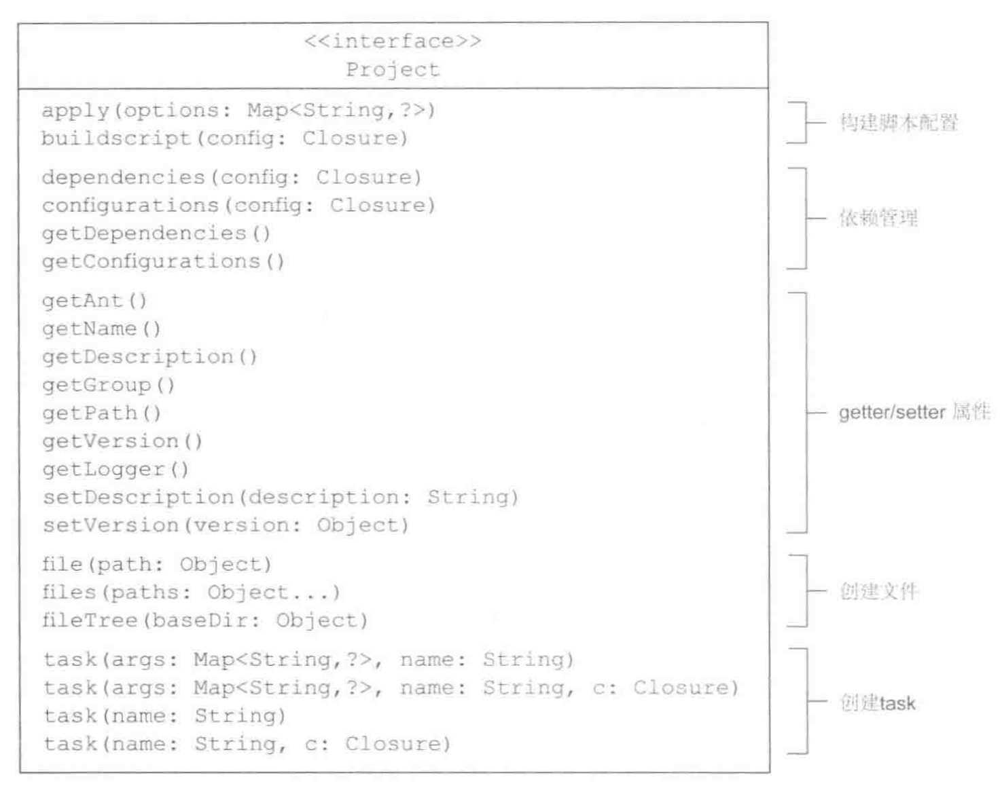

<p>本文可以学到：最基础的 Gradle构建块(project、task、property)，以及它们是如何映射到 Gradle 的 API 上面的。</p>

本篇涉及到的内容：

1. 声明简单的 task
2. 编写自定义的 task 类
3. 如何获取 task 属性


## 1. 构建块

Gradle 构建包括三个基本的构建块: `project`、`task`、`property`。每个构建中至少包含一个 `project`，进而又包含一个或者多个 `task` 。`project` 和 `task` 暴露的 `属性(property)` 可以控制 Gradle 构建过程。

<!-- more -->

Gradle 使用领域驱动设计（DDD）的原理为自己的领域构建软件模型，因此 Gradle API 中有  **相应的类** 来表示 project 和 task，具体什么是 DDD，抱歉，我也没理解。

### 1.1 project

在 Gradle 中，**一个 project 代表一个正在构建的组件，或者一个想要完成的目标**,比如需要部署的应用程序。每个 Gradle 构建脚本至少定义一个 Project。

当构建进程启动后，Gradle 基于 `build.gradle` 中的配置,实例化 `org.gradle.api.Project` 类，并且能够通过 `project` 变量使其隐式使用，可以通过查看 Project 类查看其中可用的方法.



通过上图 Project 的 API ，可以看到在脚本内可以进行脚本配置、依赖管理、读写属性值、创建文件、创建 Task 操作。

在 Android 项目中，在构建过程中构建脚本 build.gradle 将会被实例化为 Project 对象，而在 build.gradle 中的相关设定则是调用 Project 的相关方法，比如以下：


```
apply plugin: 'com.android.application'
...
```

其中 apply 则是调用了如上图所示的 Project 中的 apply 方法，同时也可以在 build.gradle 使用 JVM 语言进行相关编码，如下：

```
//使用 Groovy 语言
final def log = project.logger
final def variants = project.android.applicationVariants
//使用 Java 语言
final String name;
private String showName(){
    return name;
}
```


具体可以查看 Project 的 API：[Package org.gradle.api](https://docs.gradle.org/current/javadoc/org/gradle/api/package-summary.html) 和 [Project](https://docs.gradle.org/current/javadoc/org/gradle/api/Project.html)。


### 1.2 Task

Task 意为任务，任务有两个重要功能：**任务动作** 和 **任务依赖**。任务动作（`Action`）定义了一个任务执行时 **最小的工作单位**。

以下为定义一个 Task：
```
task clean(type: Delete) {
    delete rootProject.buildDir
}
```
该代码块在构建过程中，会被映射为 Task 类的一个实例，当然也可以在 Task 内(比如 clean 闭包)向 Project 一样使用相应的 API。

Task 对应的 Gradle API：org.gradle.api.Task 接口，可以使用相关方法，为 Task 定义动作或者依赖。


具体可查看 Task 的 API 描述: [Interface Task](https://docs.gradle.org/current/javadoc/org/gradle/api/Task.html) 。

### **1.3 属性**

每个 Project 和 Task 实例都提供了很多可以通过 setter 和 getter 方法访问的属性，属性可能是任务的描述或者是项目的版本号，也可能表示其他含义。

在项目开发中，可以自定义属性，并可以对该属性进行读写操作。自定义属性的操作，可以通过 **扩展属性** 和 **在gradle.properties 中定义** 的方式实现。

1. **扩展属性**

使用 **命名空间** `ext` 自定义属性，可以使用任意 JVM 语言，具体 Groovy 如下：

```
// 定义只读属性
project.ext.name = 'name'
// 定义可、读写属性
ext{
    age = 1
}
// 对扩展属性的修改
ext.age = 2
```

2. **在 gradle.properties 中定义**


可以在 `gradle.properties` 文件中可以添加 Gradle 属性。

* 在 `<USER_HOME>/.gradle` 文件下的 `gradle.properties` 中添加的 Gradle 属性，所有的项目都可以使用。
* 在项目下的 `gradle.properties` 中添加的 Gradle 属性，该属性所属 Project，可以在项目中所有的模块中使用。

在 gradle.properties 中声明属性：

```
name = 'tom'
age = 1
```
在 build.gradle 中的访问方式：

```
task test{
    println project.name
    println age
}
```
3. 声明属性的其他方式
   

* 在命令行模式下通过 `-P` 命令选项提供 **项目属性**
```
gradle -Pname = 'tom'
```

* 在命令行模式下通过 `-D` 命令选项提供 **系统属性**
         
`gradle -Dname = 'tom'`

使用这种方式我们可以执行 test 任务，并且传入相应属性值，具体如下：

`./gradlew -Pname=Mike test`

那么该 Task 则打印新的 name 值为 Mike。

4. 在 gradle 脚本中定义属性

Gradle 也可以在 Gradle 脚本中定义变量，通过 apply 的方式引入脚本，并在另外一个脚本中使用。

比如在 version.gradle 中定义了一些变量以及方法，大致如下：

```
def addRepos(RepositoryHandler handler) {
    handler.google()
    handler.jcenter()
    handler.mavenCentral()
}

// 定义了一个 Map
def kotlin = [:]
// 设置其 key-vaule
kotlin.plugin = "org.jetbrains.kotlin:kotlin-gradle-plugin:$versions.kotlin"
//使用其方式，暴露脚本中的自定义方法
ext.addRepos = this.&addRepos
```

那么在 **项目根目录** 的 build.gradle 中通过 `apply from` 的方式引入该文件：

```
buildscript {
    apply from: "version.gradle"
    // 调用自定义方法
    addRepos(repositories)
    dependencies {
        // 调用自定义变量
        classpath kotlin.plugin
    }
}
```

可以了解一下 API 中对 `apply from` 的描述：

<p>Applies a plugin or script, using the given options provided as a map. Does nothing if the plugin has already been applied.<p>

可以看到 apply 不仅可以引入插件，也可以引入脚本。