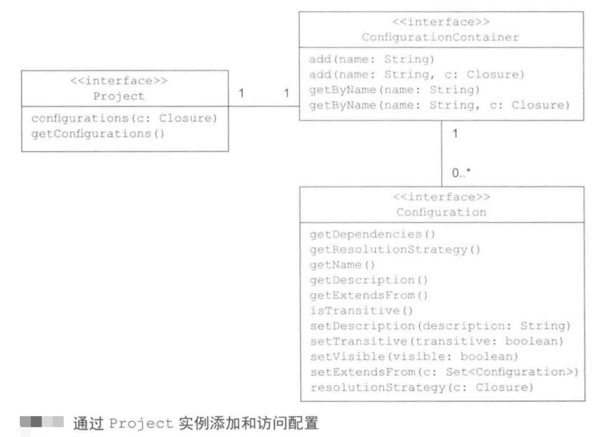

在为项目配置依赖时，可以通过 `dependencies` 和 `repositories` 两个 **DSL 配置块** 进行配置。配置块的名称直接映射到 Project 接口的方法，具体可以参见 [Project]()。

其中 `dependencies` 闭包用来定义项目构建所依赖的类库，而  `repositories` 闭包则告诉构建从哪里获得这些依赖。

<!-- more -->

依赖管理器通过运行以上两个配置，从中央仓库下载项目中所需要的库，并将它们存储在本地缓存中,具体可以参见以下示意图：从 Maven 远端仓库下载构建依赖。


## 1. 依赖配置

在 Gradle 中 配置 译为 Configuration。

在 Gradle 中，**依赖配置** 是十分重要的概念，插件可以引入配置，来 **定义依赖的作用域**。

在项目中引入 Java 插件，就可以引入了其各种标准配置，来定义 Java 构建生命周期所应用的依赖。比如通过 compile 来配置添加编译源代码所需要的依赖。


## 2. 通过 API 认识配置(Configuration)

配置 (`Configuration`) 可以 在项目(Project)的 **根级别** 添加和访问，j具体可以参见 API：[Project#	getConfigurations()](https://docs.gradle.org/current/javadoc/org/gradle/api/Project.html),可以使用插件提供的配置，也可以使用自己声明的配置。

每个 Project 都有一个 `ConfigurationContainer` 类容器来管理自己相应的配置。

具体 API 具体如下：



可以看到配置对象 (Configuration) 含有一些属性，比如 name、description 等。

### 配置的使用场景

1. 配置是很灵活的，可以使用配置控制配置依赖解决方案追溯是否包含传递性依赖、定义解决策略（比如，如何解决版本冲突）等，同时使用配置可以进行。
2. 使用配置进行逻辑分组

配置分组与 Java 中包的概念十分相似，包针对其包含的类提供唯一的命名空间，同样这也适用于配置，通过逻辑分组把职责相同的配置放在一起。

在 Java 中提供了 6 个现成的配置：api、implementation、compileOnly、runtimeOnly 等，随着版本的更新配置的数量和种类也在变化,具体可以参见 [The Java Library Plugin](https://docs.gradle.org/current/userguide/java_library_plugin.html#example_making_the_difference_between_api_and_implementation)。

在 Gradle 中，也可以自定义配置，实现自己的逻辑。比如需要引入部署应用的依赖 Cargo 库，但是如果使用 Java 提供的配置中的一个，会将应用程序代码和部署应用的代码相应的环境混淆，导致发布时将不必要的类库添加到发布包中，此时我们可以通过自定义配置来解决这个问题。


## 3. 自定义、使用配置

### 自定义配置

为了明确 Cargo 所需的依赖，在 `configurations` 中声明一个名为 `cargo` 的新配置，具体如下：

```
configurations{
    cargo{
        description = 'classpath for cargo ant tasks'
        visibile = false
    }
}
```

为项目配置容器添加配置后，可以直接通过配置名称进行使用。


### 使用配置

此时就可以在配置块中使用 cargo 配置，并在相应的 Task 中使用配置相应内容，并且自定义的配置也可以使用向排除传递性依赖、动态版本号等特性，具体参见以下代码。

使用 Ant 的相关特性使用自定义配置，具体如下：

```
task deployToLocalTomcat << {
    // 以文件树的形式获取 cargo 配置所有的依赖
    FileTree cargoDependencies = configurations.getByName('cargo').asFileTree
    ant.taskdef(resource: 'cargo.tasks', classpath: cargoDependencies.asPath)
    ant.cargo(containerId: 'tomcat7x', action: 'run', output: "$buildDir/output.log") {
        configuration {
            deployable(type: 'war', file: 'todo.war')
        }

        zipUrlInstaller(installUrl: 'http://archive.apache.org/dist/tomcat/tomcat-7/v7.0.50/bin/apache-tomcat-7.0.50.zip')
    }
}

ext.cargoGroup = 'org.codehaus.cargo'
ext.cargoVersion = '1.3.1'

// 在配置块中通过自定义配置声明依赖
dependencies {
    cargo group: cargoGroup, name: 'cargo-core-uberjar', version: cargoVersion
    cargo "$cargoGroup:cargo-ant:$cargoVersion"
    cargo('org.codehaus.cargo:cargo-ant:1.3.1') {
        exclude group: 'xml-apis', module: 'xml-apis'
    }
    cargo('org.codehaus.cargo:cargo-ant:1.3.1') {
        transitive = false
    }
     cargo 'org.codehaus.cargo:cargo-ant:1.+'
}

repositories {
    mavenCentral()
}
```

## 声明依赖

DSL 配置块 `dependencies` 通常用来将一个或者多个依赖指派给配置，但是外部依赖并不是依赖的唯一方式。

### 依赖的方式

* 外部模块依赖（dependencies）
* 项目依赖（setting）
* 文件依赖（dependencies 中 fileTree）
* Gradle 运行时依赖
* 客户端模块依赖（不常见）。

### 依赖相关 API

每个 Gradle 项目都有 **依赖处理器实例**，由 `DependencyHandler` 接口来实现。

每个依赖项都是 `Dependency` 类型的一个实例，通过 `group、name、version、classifier` 属性，明确 **标识了一个依赖**。

具体 API 关系如下：


### 外部模块依赖

在 Gradle 中，外部类库通常以 `Jar` 文件的形式存在，被称为 **外部模块依赖**，此类型的依赖可以通过依赖属性唯一标识，比如：

`androidx.appcompat:appcompat:1.1.0`

**依赖属性**：

* group
  
这个属性用来标识一个组织、公司或者项目，比如 androidx.appcompat。

* name

标识一个库的名称，唯一描述了依赖，比如 appcompat。

* version

描绘了一个库的版本号。

* classifier

可以定义另一个属性，但是以上并没有定义该属性。


### 依赖标记


在项目中通过以下形式来声明依赖：

```
dependencies{
    // 比如 api com.xx.xx
    // 首先是配置名称，比如 api、runtimeOnly，以及上文自定义的 cargo
    // 然后是依赖标记，比如 androidx.appcompat:appcompat:1.1.0
    configurationName dependency
}
```

### 检查依赖报告

在 `dependencies` 配置中声明的依赖为 **顶层依赖**，这些顶层依赖所依赖的库称为 **传递性依赖**。

运行 `gradle dependencies` 会显示完整的 **依赖树**。**依赖树显示了在构建脚本中声明的顶层依赖，以及它们的传递性依赖。**

但是在自己实测过程中，需要指定 moudle 来展示依赖树，即在项目根目录下需要运行：

`./gralew app:dependencies` 或者 `gradle app:dependencies`。


在依赖树中，**标有星号的依赖被排除了**，这意味依赖管理器使用的是 **另外一个版本** 的类库，因为他被声明 *另外一个顶层依赖* 的传递性依赖。


**针对版本冲突，Gradle 默认的解决策略是获取最新的版本**，在依赖树中这样展示：1.0.0 -> 1.1.0，而在依赖报告中，标有星号的依赖被排除了，意味着依赖管理器选择的是相同或者另一个版本的类库。

### **排除传递性依赖**

#### **排除传递性依赖:依赖指定版本的远端库**

假如想要显式的指定某个类库的版本，而不使用顶层依赖所提供的传递性依赖，可以通过 **exclude** 排除指定库，具体操作如下：

```
dependencies{
    // 通过 exclude 来声明排除某项依赖的指定传递性依赖
    cargo('org.codehaus.cargo:cargo-ant:1.3.1'){
        exclude group:'xml-apis',module:'xml-apis'
    }
    // 依赖指定版本的库
    cargo 'xml-apis:xml-apis:2.0.2'
}
```

#### **排除传递性依赖:排除所有的传递性依赖**

如果想要 **排除一个库的所有传递性依赖**，Gradle 提供了 `transitive` 属性来实现这一效果。

```
dependencies{
    // 通过 exclude 来声明排除依赖
    cargo('org.codehaus.cargo:cargo-ant:1.3.1'){
        transitive = false
    }
}
```

### **动态版本声明**

如果不想要指定依赖库的版本号，可以获取最新版本的依赖或者在版本范围内选择最新的依赖。

动态版本声明有特定的语法，如果想要使用 **最新版本的依赖**，则必须使用占位符 `lastest.intergration` 或者声明版本属性，通过使用一个加号（+）标定它来动态改变。

```
dependencies{
    cargo 'xml-apis:xml-apis:lastest.intergration'
    cargo 'xml-apis:xml-apis:2.0.+'
}
```

**不要最好不要使用动态版本，因为在项目的开发中，可靠性和可复用是最重要的，但是选择最新版本的类库可能在开发者不知情的情况下引入了不兼容的类库版本和副作用，基于此应该声明明确的类库版本。**

也可以指定版本的范围，具体查看Gradle 在线手册。


### **文件依赖**

Gradle 依赖也可以依赖本地的文件。

这样一个场景：定义一个 Task，用于将从 Maven Central 获取的依赖拷贝到 home 目录下的 libs/cargo 子目录中。

```
task copyDependenciesToLocalDir(type:Copy){
    from confingurations.cargo.asFileTree
    into "${System.properties['user.home']}/libs/cargo"
}
```
在 dependencies 配置块中声明 Cargo 类库，以下展示通过 `fileTree` 属性把 Jar 文件指派给 cargo 配置作为文件依赖。

```
dependencies{
    cargo fileTree (dir:"${System.properties['user.home']}/libs/cargo",include '*.jar')
    // 平时我们在 Android 如下使用，进行文件依赖
    implementation fileTree(dir: 'libs', include: ['*.jar'])
}
```

## 使用和配置仓库

### 仓库 API

在项目中定义仓库的关键是 `RespositoryHandler` 接口，**该接口提供了添加各种类型仓库的方法**，这些方法可以在 respositories 配置块中被调用。


通过上图可以看，不同类型的仓库提供了不同方法来进行相关配置，以下展示每种仓库的具体配置。

### Maven 仓库

最常的仓库，类库通常以 jar 文件的形式表现，元数据用 xml 标出，并且使用 pom 文件描述了类库相关信息以及其传递性依赖。

Maven 仓库下所有类库的内容会被存储在一个预定义的目录结构中，在声明一个依赖时，依赖的属性（group、name、version）来确认它在仓库中的位置。


Maven 提供了两个方法用来配置 Maven 仓库：

* mavenCentral()

将 Maven Central 引用添加到一系列的仓库中。

```
repositories{
    mavenCentral()
}
```

* mavenLocal()

在文件系统中关联一个本地的 Maven 仓库，本地 Maven 仓库的默认目录为：<USER_HOME>/.m2/repository。
```
repositories{
    mavenLocal()
}
```


### 自定义 Maven 仓库

很多情况下，我们需要配置企业级的仓库来完成相应的开发，仓库管理器提供类了一个以 Maven 结构来配置仓库的功能，Gradle API 提供了两个方式来配置自定义仓库：

* maven()

```
repositories{
    maven{
        name 'custom maven repository'
        url 'http://xxx/xxx/release/'
    }
    // 也可以自定义引用本地的库
    maven{
        name 'custom maven repository'
        url '../repo'
    }
}
```

* mavenRepo()


### Ivy 仓库

Maven 仓库中的文件必须以一个固定的布局存储，任何文件结构的偏差都有可能导致依赖关系发生变化，而 Ivy 仓库则可以完全自定义默认布局。

在 Ivy 里，仓库依赖被存储在 ivy.xml 文件中，Gradle 提供了各种方法来配置 Ivy 仓库及特定的文件布局。


声明 ivy 仓库

```
repositories{
    ivy{
        // Ivy 仓库的基础 URL
        url 'http://xxx/xxx/release/'
        layout 'pattern',{
            // 工件模式
            artifact '[xx]/[xxx]/[version].[ext]'
            // 元数据模式
            ivy '[xx]/[xxx]/[version]/ivy-[revision].xml'
        }
    }
}
```

### 扁平的目录仓库

flat 目录仓库是最简单和最基本的仓库形式，**在文件系统中它是一个单独的目录**，**只包含了 jar 文件，没有元数据**。

**当声明此种仓库中的依赖时，只能使用 name 和 version 属性，不能使用 group 属性，因为它会产生不明确的依赖关系**。

以下通过 map 和 快捷方式来声明从 flat 目录仓库中获取 Cargo 依赖。

```
// 声明扁平的目录仓库
repositories{
    flatDir (dir:"${System.properties['user.home']}/libs/cargo",name :'Local lins directory')
}
dependencies{
    // 以 map 的形式声明依赖，只可以使用 name 和 version 属性
    cargo name:'activation',version:'1.1.0'
    // 以快捷方式获取依赖
    cargo ':jaxb-api:2.1.1' 
}
```

**需要手动的声明传递性依赖**，需单独的声明每个依赖，这种方式耗时耗力。


## 理解本地依赖缓存

以上阐述了如何声明各种类型的仓库，在执行的 Task 会自动确定所需要的依赖，**在执行时从仓库中下载工件**，**并将它们存储在本地缓存中** ，在之后的任何构建都会重用这些工件。


此节将深入分析缓存结构，确定缓存在底层是如何工作的，以及如何调整其行为。

### 分析缓存结构


执行 Task ，Gradle 下载的 jar 文件被存放在何处？

通过以下操作，打印出完整的、指派个 cargo 配置的所有依赖的连接路径。

```
task printDependencies{
    doLast{
        configurations.getByName('cargo').each {depency ->
            println depency
        }
    }
}
```
执行该 Task 会发现所有的 jar 文件都存储在 `.gradle/caches/artifacts-15/filestore` 目录中，而 artifacts-15 为一个标识符，用来指定Gradle 版本，同时需要注意的是这个文件目录结构在不同的Gradle 中可能不同。


缓存其实包含两部分：

* filestore 中的文件

该目录中包含了从仓库下载的原始二进制文件,比如 Jar 文件。

* 其他二进制文件

这些文件中存储了已下载工件的 **元数据**。


具体可参见：[The Directories and Files Gradle Uses](https://docs.gradle.org/current/userguide/directory_layout.html#dir:gradle_user_home)

以下为 .gradle 目录下的 cache 各个文件的含义：

```
├── caches // (1) 全局缓存目录
│   ├── 4.8 // 特定版本的缓存，支持增量更新
│   ├── 4.9 // (2)
│   ├── ⋮
│   ├── jars-3 // 共享缓存，例如对于依赖项的工件
│   └── modules-2 // (3)
├── daemon // (4)Gradle 守护进程的注册表和日志
│   ├── ⋮
│   ├── 4.8
│   └── 4.9
├── init.d // 全局初始化脚本
│   └── my-setup.gradle
├── wrapper
│   └── dists // 由Gradle包装器下载的发行版
│       ├── ⋮
│       ├── gradle-4.8-bin
│       ├── gradle-4.9-all
│       └── gradle-4.9-bin
└── gradle.properties // 全局层次配置属性
```


### 缓存过期

缓存下来文件并不会永久存在，会在一定时期内有效，如果在规定期限内某版本库不再被使用，那么相应版本库就会被清除，具体可参见[The Directories and Files Gradle Uses](https://docs.gradle.org/current/userguide/directory_layout.html#dir:gradle_user_home)

支持在规定时间删除缓存和版本，同样见上面链接。

## 解决依赖问题

如果选择自动解决传递性依赖，那么版本冲突是不可避免的，Gradle 解决版本冲突的默认策略是选择最新的依赖版本。**依赖报告** 是十分有用的工具，它可以帮助我们选择需要的依赖版本。

### 修改默认的策略

做如下修改，当遇到版本冲突时，会让构建失败,此时在打印台上你可以很清楚的指导那些传递依赖库发生了版本冲突。

```
configurations.all{
  resolutionStrategy{
      // 修改gradle不处理版本冲突
      failOnVersionConflict()
  }
}
```
此处为所有的配置重新配置策略，也可以 **为指定的配置重新配置冲突解决策略** ，比如上文一直使用的 cargo。


```
configurations.cargo.resolutionStrategy{
    failOnVersionConflict()
}
```

### 强制指定一个版本

```
configuration.all{
  resolutionStrategy{
      failOnVersionConflict()
      force 'org.slf4j:slf4j-api:1.7.24'
  }
}
```
此处为所有的配置重新配置策略，也可以为指定的配置重新配置冲突解决策略。

```
configuration.cargo.resolutionStrategy{
    force 'org.slf4j:slf4j-api:1.7.24'
}
```
### 依赖观察报告

依赖观察报告，解释了依赖图中的依赖是如何选择的以及为什么。

为了运行这个报告需要指定两个参数：配置名称（默认是 compile）和依赖本身。

> gradle -q dependencyInsight --configuration cargo --dependency xml-apis:xml-apis

dependencyInsight:显示原因

* 与 gradle dependencies 的不同

使用 `gradle dependencies` 生成的依赖报告，是从顶层依赖开始的，而此处的依赖观察报告则与之相反，是从 **低层到顶层的**。


图片显示了需要和选择的 xml-apis:xml-apis 的版本以及原有

[Gradle 命令行选项含义](https://docs.gradle.org/current/userguide/command_line_interface.html#common_tasks)


### 刷新缓存


针对依赖的 SNAPSHOT 版本和使用动态版本的模式声明依赖，Gradle 一旦获取了依赖，它们会 **缓存 24 小时**，在缓存时间到后，会再次检查仓库，如果依赖库发生版本变化，Gradle 会下载最新的依赖库。


可以使用命令行选项 --refresh-dependencies 手动刷新缓存中的依赖，这个标志会强制检查配置仓库中所依赖的库版本是否发生了版本变化，如果变化则再次下载，取代缓存中的副本。


同时 Gradle 也支持配置缓存的默认行为，

* 设置缓存动态依赖版本 0 秒超时

```
configuration.cargo.resolutionStrategy{
    cacheDynamicVersionsFor 0,'second'
}
```

* 不缓存 SNAPSHOT 版本

```
configuration.cargo.resolutionStrategy{
    cacheChangingMoudlesFor 0,'second'
}
```
