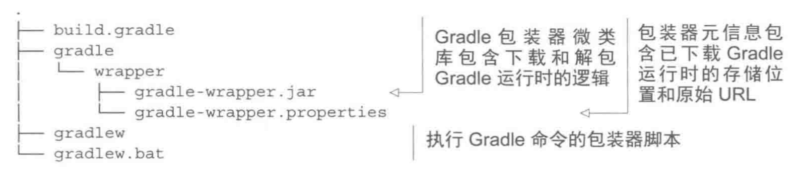

## 1. Java 项目引入 Gradle 插件

当我们不通过 IDE 的方式构建 Java 项目，那么在编写完成后，运行项目就需要使用 javac 、jar 等这样的工具来帮我们运行项目，无疑在开发过程中这是十分痛苦的。而 Gradle 插件具体自动化执行编译、运行等过程。Gradle 通过引入特定领域的约定和 Task 来扩展项目。而 Java 插件是 Gradle 自身装载的一个插件，可以实现很多的功能，比如定义标准的项目布局、有顺序的执行任务。
<!-- more -->

如果想要使用 Java 插件，构建编写的 Java 代码，则在需要在 build.gradle 中添加如下代码：

```
apply plugin:'java'
```
Java 插件引入很多规则，其中之一是项目的源代码位置，默认情况下 Java 插件会到 `src/main/java` 目录下查找 Java 类。

## 2. 构建 Java 项目

引入了 Java 插件后，就可以进行构建项目。Java 插件中的存在名为 `build` 的任务，该任务可以正确的顺序编译项目源代码，运行测试、组装 Jar 文件等操作。

创建 Java 项目后，执行 `gradle build` 会得到相应的输出，每一行输出为 Java 插件提供的一个可执行任务，有些任务被标记了 `UP-TO-DATE`，这意味着 **这个任务被跳过了**，因为 Gradle **支持增量式构建**，不会运行不需要运行的任务，以下会介绍该概念。

## 3. 构建产生的文件

执行以上命令后，可以发现在根目录生成了一个 `build` 目录，该目录包含了构建运行时的所有输出，包括 jar 文件、测试报告和 class 文件，还有一些像类似清单、对构建有用的临时文件。

其中关于 Android 项目构建完成后，项目中还会创建 .gradle 和 .idea 文件夹，其中存放 Gradle 和 AS 对于当前工程的缓存，在点击 sync 后，AS 还会生成 .iml 文件，他们与 .gradle、.idea 配合为我们提供了代码提示等常见功能，具体内容可以参见 [Gradle 与 Android 构建入门](https://mp.weixin.qq.com/s/HdCrhiY3VSsEjmu0FKLlyg)。


构建输出的目录的名字是可以通过 Gradle 的相关属性进行配置修改的，但是不建议自定义.对 Java 项目完成构建后，可以运行该项目：

> java -cp build/classes.main com.xxx.xx.Main

-cp: 即为 -classpath，告诉 Java 运行时去哪里找到 class 文件。

## 4. 解析依赖

在构建脚本中添加依赖，如果依赖库没有被解挂过（成功下载过），那么就会在使用时去下载它，以下图片展示了依赖继续传递性依赖的过程：


## 5. Gradle  包装器

Gradle 包装器是 Gradle 的核心特性，能够让机器在没有安装 Gradle 运行时的的情况下，运行 Gradle 构建。

在项目中配置包装器，需要两步操作：

1. 创建包装器任务

```
task wrapper(type:Wrapper){
    // 指定下载的 Gradle 版本（可以指定不同于系统配置的 Gradle 版本）
    gradleVersion = '5.4.1'
}
```

2. 执行任务

```
gradle wrapper
```

下载的文件目录如下：



其中的 gradle-wrapper.properties 文件内容大致如下：
```
distributionBase=GRADLE_USER_HOME
distributionPath=wrapper/dists
zipStoreBase=GRADLE_USER_HOME
zipStorePath=wrapper/dists
distributionUrl=https\://services.gradle.org/distributions/gradle-5.4.1-all.zip
```
此时，就可以使用包装器的脚本执行构建类。

## 6. 定制包装器

包装器是可以被重新配置的，可以指向运行有发布文件的企业内部服务器，同时还可以指定本地存储路径.

```
task wrapper(type:Wrapper){
    gradleVersion = '5.4.1'
    distributionUrl = ’http://companycenter.com/gradle/dists‘
    distributionPath = 'gradle-dists'
}
```