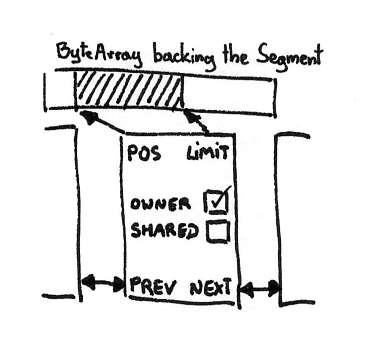
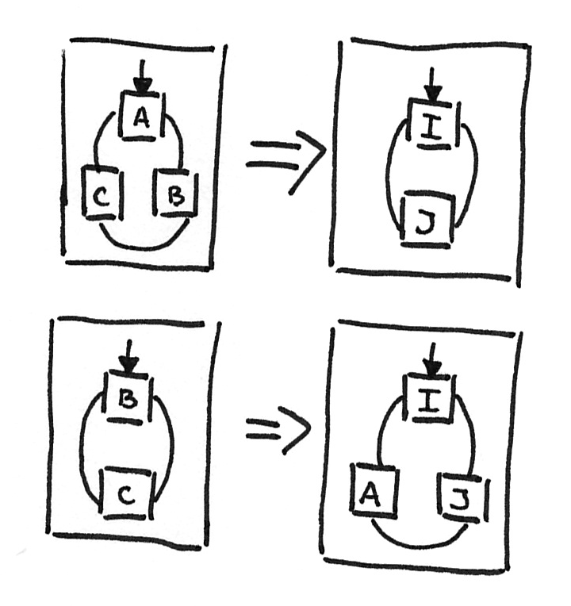

原文链接：[A closer look at the Okio library](https://medium.com/@jerzy.chalupski/a-closer-look-at-the-okio-library-90336e37261)

## Source、Sink、Buffer

Okio 中两个重要的接口为 Source、Sink，Source 类似 Java 传统 IO 中的 InputStream，描述可以从中读取数据到内存中，而 Sink 类似 OutputStream，表示 Okio 可以将数据写到指定的位置。

<!-- more -->

在 Java 传统 IO 中，基于 **装饰者模式** 将流(Stream) 嵌套在 Buffer (BufferedInputStream\BufferedOutputStream) 中，这样做的目的是一次性读取大量数据到 Buffer 中，避免 IO 操作，提高性能。Okio 可能借鉴了 Java I/O,因为 Source 和 Sink 所有的实现要么委托给其他的 Sources 或 Sink，要么在后台使用 Buffers。

Buffer 实现了 Source 和 Sink 两个接口( BufferedSource, BufferedSink，两者分别为 Source 和 Sink 实现接口，提供丰富的便利方法)，

在 Java 中 IO 流使用固定字节的数组来保存缓冲的数据，具体为以下代码，而 Okio 中使用了 Segment，Buffer 和 Segment 共同构成了 Okio 的核心功能。

```
try (InputStream inputStream = new FileInputStream("./origin_text.txt");
     OutputStream outputStream = new FileOutputStream("./copy_buffer_txt.txt");
     Reader reader = new InputStreamReader(inputStream);
     Writer writer = new OutputStreamWriter(outputStream);
     BufferedReader bufferedReader = new BufferedReader(reader);
     BufferedWriter bufferedWriter = new BufferedWriter(writer)) {
    // 使用固定长度的缓存
    char[] buffer = new char[1024];
    int length;
    while ((length = bufferedReader.read(buffer)) != -1) {
        bufferedWriter.write(buffer, 0, length);
    }
} catch (FileNotFoundException e) {
    e.printStackTrace();
} catch (IOException e) {
    e.printStackTrace();
}
```


## Segments

Segment 为双向链表，通过 Segment 引用可以访问它的前继、后驱 Segment 节点，同时 Segment 中持有实际的 ByteArray 的缓存区。Segment 中关键的变量有两个游标：pos、limit，两个标志位：owner、shared。



在内部，Buffers 以 **循环链表** 的形式使用 Segment，这样只需维护一个 Segment 引用就可以访问 Buffer 的两端用来读取和写入数据。


这意味着可以在不影响其他操作该 Buffer 的 Sink 和 Buffer 对该 Buffer 进行读写。

这意味着 Buffer 在不影响对其操作的其他 Source 和 Sink 的情况下实现安全的增长，相对的，在传统 IO 的 BufferedInputStream 和 BufferedOutputStream 中，写入数据可能会导致一系列的刷新动作，两种不同的特性查看图例：


Sinks 和 Sources 通过 **管道(pipe)** 建立连接，但是 Okio 的设计者认为无需像 Java 传统 IO 中的缓冲流一样在管道之间复制数据，所以在 Okio 中所有的 Sources 和 Sinks 在后台使用 Buffers，并且 Buffers 通过 Segment 持有数据，所以可以将 Segment 从一个 Buffer 移动到另外一个 Buffer 中，这个过程中没有拷贝的动作，具体查看图例：



但是如果不想移动整个 Segment 该如何操作？

Okio 使用另外一种操作来实现这种 CPU 密集型的 ByteArray 复制操作：**在不同的 Segment 之间共享数据缓冲区**。 Okio 可以创建 **由相同的 ByteArray 支持的其他 Segment**，而不是将 ByteArray 的一部分复制到另一部分，这边复制数据本身要轻量的多。该功能的实现通过 Segment 中的 pos 和 limit 字段实现，这两个字段界定 每个 Segment 的共享的 ByteArray 的数据范围。


在上面的图例中，两个 Segment 均标记 shared 为 true，通过该字段 Okio 知道 ByteArrat 可以被不同 Segment 共同使用，但是被共享的 ByteArray 无法执行某些操作，比如，不能向头 Segment 写入数据，因为这样可能会覆盖头 Segment 的起始数据，另一方面，应该声明处共享 ByteArray 的最后使用区域，但是每个 ByteArray 只能属于一个 Segment，所以要确保共享 ByteArray 的 Segment 只能有一个 Segment 将 owner 置为 true。


对于 ownner Segment 可以执行另外一项操作：数据移位。如果正在使用 ByteArray 的后半部分，并且这部分区域容量不足，如果 Segment 没有共享，那么可以将现有的数据移至 ByteArray 的开头，然后追加新的数据。如果 ByteArray 被其他 Segment 共享，那么无法进行以上操作，因为 ByteArray 的前半部分可能会被其他 Segment 使用。


持有这些变量需要消耗 Segment 和 Buffer 的额外空间，但是它们可以大幅提高性能。

## Segment Pool

Okio 提供了另一项优化：将所有 Owner Segment 合并，用来减少 ByteArray 的初始化，在当前的实现中存在固定大小的  Segment 缓存，通过 Segment 链表实现。

```
Source source = Okio.source(new File("./19_i0_text.txt"));
Buffer buffer = new Buffer();
source.read(buffer, 1024);
// 0.
System.out.println(buffer.readUtf8());
```


```
   return new Source() {
      @Override public long read(Buffer sink, long byteCount) throws IOException {
        if (byteCount < 0) throw new IllegalArgumentException("byteCount < 0: " + byteCount);
        if (byteCount == 0) return 0;
        try {
          timeout.throwIfReached();
          Segment tail = sink.writableSegment(1);
          int maxToCopy = (int) Math.min(byteCount, Segment.SIZE - tail.limit);
          // 1.
          int bytesRead = in.read(tail.data, tail.limit, maxToCopy);
          if (bytesRead == -1) return -1;
          // 2.
          tail.limit += bytesRead;
          sink.size += bytesRead;
          return bytesRead;
        } catch (AssertionError e) {
          if (isAndroidGetsocknameError(e)) throw new IOException(e);
          throw e;
        }
      }
```


```
  @Override public String readUtf8() {
    try {
      return readString(size, Util.UTF_8);
    } catch (EOFException e) {
      throw new AssertionError(e);
    }
  }

```


```
  @Override public String readString(long byteCount, Charset charset) throws EOFException {
    checkOffsetAndCount(size, 0, byteCount);

    Segment s = head;
    if (s.pos + byteCount > s.limit) {
      // If the string spans multiple segments, delegate to readBytes().
      return new String(readByteArray(byteCount), charset);
    }

    String result = new String(s.data, s.pos, (int) byteCount, charset);
    // 3. 移动游标 pos 的位置 
    s.pos += byteCount;
    // 4. size 读取的字节数，更新重新置为 0 
    size -= byteCount;

    // 
    if (s.pos == s.limit) {
      // 移除 Segment
      head = s.pop();
      // 6. 缓存 Segment
      SegmentPool.recycle(s);
    }

    return result;
  }
```

1. 将数据拷贝至 Segment 的 data 中；
2. 改变 Segment 的 limit 和 size 值；
0. 读取 Segment 中 data 的数据