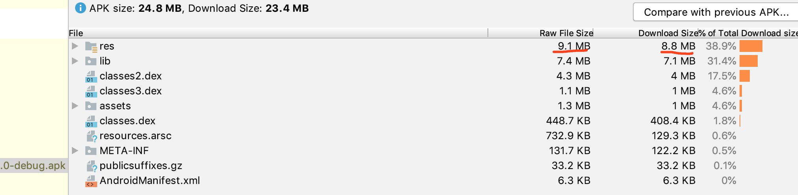

## 0x0000 打包流程：


从图上可知，引入的 Jar 包经过混淆，移除无用的代码，也会被打包到 dex 文件中。

或者参考这张简化版的打包流程图：
<!-- more -->


## 0x0001 包体积与应用性能


* 安装时间

文件拷贝、Library 解压、编译 ODEX、签名校验，特别对于 Android 5.0 和 6.0 系统来说（Android 7.0 之后有了混合编译），微信 13 个 Dex 光是编译 ODEX 的时间可能就要 5 分钟。

* 运行内存

Resource 资源、Library 以及 Dex 类加载这些都会占用不少的内存。

* ROM 空间

100MB 的安装包，启动解压之后很有可能就超过 200MB 了。对低端机用户来说，也会有很大的压力。如果闪存空间不足，非常容易出现写入放大的情况。


## 0x0002 Dex 分包导致包体积增大

使用 AS 查看 APK 的 dex 文件时，可以看到如下所示的信息：


* “define classes and methods”是指真正在这个 Dex 中定义的类以及它们的方法。
* “reference methods”指的是 define methods 以及 define methods 引用到的方法。

举一个浅显的例子：如果将 Class A 与 Class B 分别编译到不同的 Dex 中，由于 method a 调用了 method b，所以 classes2.dex 文件中也需要加上 method b 的id，如下图所示：


如图所示，由于跨 Dex 调用的存在，导致有些 Dex 文件中存在一些冗余信息，比如图中 classes2.dex  中的 method id。此现象的存在对 Dex 的大小的影响：

* method id 爆表

我们都知道每个 Dex 的 method id 的数量需要小于 65536，**因为 method id 的大量冗余导致每个 Dex 真正可以放的 Class 变少**，这是造成最终编译的 Dex 数量增多。
 
* 冗余信息

因为我们 **需要记录跨 Dex 调用的方法的详细信息**，所以在 classes2.dex 我们还需要记录 Class B 以及 method b 的定义，造成 string_ids、type_ids、proto_ids 这几部分信息的冗余。


很明显提升 Dex 中 define methods 中的比重，会减少 dex 的体积，那么 APK 的体积也会减少。那么如何提高 Dex 中 define methods 中的比重呢？**将有调用关系的类和方法分配到同一个 Dex，即减少跨 Dex 调用的情况**。但是针对此的优化只能达到局部最优解，因为需要在编译速度和效果之间找一个平衡点。


## 0x0003 包体积优化措施：压缩代码


**1. 使用 minifyEnabled 属性**

开启 minifyEnabled true 属性，会进行 **无用代码的裁切**。

**2. 进行混淆**

除了启用 minifyEnabled 属性，还可以在 `proguard-rules.pro` 文件中配置混淆规则，把相关类和方法混淆成短路径，比如混淆方法：

```
void show()  -> void a()
```

**将类和方法混淆成短路径**，那么构建的 Dex 文件的大小也会减小。


## 0x0004 包体积优化措施：移除无用的资源

Android 官方早就为我们考虑好了，以下为关于无用资源优化方案的演进：

**第一阶段: Lint：移除无用的资源**

Lint 是一款静态代码扫描工具，其中有一项关于 Unused Resources 的扫描，然后直接选择 `Remove All Unused Resources`，这样就可以直接删除所有无用的资源。

但是 Lint 作为第一阶段的方案，在扫描过程中存在一些缺点：

    由于 Lint 是静态代码扫描工具，其最大的问题是没有考虑到 ProGuard 的代码裁剪，在 ProGuard 过程中会 shrink 掉大量的无用代码，但是 Lint 工具并不会检查出这些无用代码引用的无用资源。

当然 Lint 还有很多其他的特色功能：检查布局嵌套过深、存在的内存泄漏隐患等。

虽然 Lint 移除了大量的无用资源，但是系统目前的做法并没有真正减少文件数量。这样 resources.arsc、签名信息以及 ZIP 文件信息这几个“大头”依然没有任何改善，具体可以查看实操篇中的阐述。


> resources.arsc、R.java 文件的资源 ID 是连续的。


**Lint Unuse resource**


此处的 APK 为 build 生产的包，Lint 移除无用资源后的 Apk 的变化。




**第二阶段：shrinkResources： 移除没有被代码显式引用的资源**

基于 Lint 的缺点，在第二阶段 Android 增加了 shrinkResources 的资源压缩功能，但是它需要和 ProGuard 的 minifyEnabled 功能配合使用，启用 minifyEnabled 功能会将部分无用的代码移除，而这些代码引用的资源也会被标记为无用资源，开启 shrinkResources 通过资源压缩功能将它们移除。

要使用 shrinkResources，您必须启用代码压缩功能。在编译过程中，首先，ProGuard 会移除未使用的代码，但会保留未使用的资源。然后，Gradle 会移除未使用的资源

```
android {
    ...
    buildTypes {
        release {
            minifyEnabled true
            shrinkResources true
        }
    }
}
```
但是目前的 shrinkResources 在实现上还是存在以下缺陷：

1. 没有处理 resources.arsc 文件，导致大量无用的 String、Id、Attr、Dimen、Color 等资源并没有被删除。


如上图，以 umeng 开头的 color 资源其实在应用中并没有被使用，但是还是存在于 resources.arsc。

2. 没有真正的删除资源文件。

对于 Drawable 、Layout 这些无用资源，shrinkResources 也没有把它们真正删掉，而仅仅替换为一个空文件，为什么不删除呢？由于 没有处理 resources.arsc 文件，所以 resources.arsc 中还有这些文件的路径。


如上图，标记的文件在 Apk 中被替换为 空文件。


同时在生成的 resources.txt 文件中也可以看到该文件被替换为空文件的的日志：


除了上述将无用的资源文件替换为空文件的情况，也存在对无用的资源文件不做任何处理的情况，如下图所示：


可以看到 activity_edit_address.xml 在文件中没有被引用，该文件在 Apk 构建过程中也没有被替换为空文件，到 resources.txt 文件中去查看该文件的信息：


那么为什么会出现这种情况呢，具体可以看 [ResourceUsageAnalyzer.java](https://android.googlesource.com/platform/tools/base/+/studio-master-dev/build-system/gradle-core/src/main/java/com/android/build/gradle/tasks/ResourceUsageAnalyzer.java) 中的相关代码：

```
if (mFoundWebContent) {
                Resource resource = mModel.getResourceFromFilePath(string);
                if (resource != null) {
                    ResourceUsageModel.markReachable(resource);
                    continue;
                } else {
                    int start = 0;
                    int slash = string.lastIndexOf('/');
                    if (slash != -1) {
                        start = slash + 1;
                    }
                    int dot = string.indexOf('.', start);
                    String name = string.substring(start, dot != -1 ? dot : string.length());
                    if (names.contains(name)) {
                        for (Map<String, Resource> map : mModel.getResourceMaps()) {
                            resource = map.get(name);
                            if (mDebug && resource != null) {
                                mDebugPrinter.println("Marking " + resource + " used because it "
                                        + "matches string pool constant " + string);
                            }
                            ResourceUsageModel.markReachable(resource);
                            // 加入白名单
                            mModel.addResourceToWhitelist(resource);
                        }
                    }
                }
            }

```

大致意思资源文件名的前缀包含在 string pool 中，那么该文件会被包含在白名单中，在资源压缩、移除过程中，不会被置为空文件或者删除，在该项目中以 umeng 开头的 Layout 文件也不会被置空或删除，但是 string pool 是如何初始化的，自己没有进一步阅读源码，还不清楚，有空仔细阅读。

针对此种情况，可以先使用 Lint 工具对项目进行 Unused Resources 的扫描，并且移除。

----

[压缩、混淆和优化您的应用](https://developer.android.google.cn/studio/build/shrink-code.html#top_of_page)，在 outputs/mapming 文件夹下会生成以下文件：

* dump.txt:描述apk文件中所有类文件间的内部结构.
* mapping.txt:列出了混淆过的类、方法和字段名称与原始名称的映射关系，能够通过该文件进行解码混淆过的堆栈轨迹，比如上传到 友盟统计平台，显示 bug 的堆栈轨迹。
* seeds.txt:项目的保留规则确定的入口点的报告(列出未进行混淆的类和成员)。
* usage.txt:移除的代码的报告。
* resources.txt：此文件包含一些详细信息，如哪些资源引用了其他资源以及使用或移除了哪些资源。

----


**第三阶段：realShrinkResources**

目前 Android 还没有提供这套方案的实现，故不详述。

----


[缩减应用大小](https://developer.android.google.cn/topic/performance/reduce-apk-size)

[压缩、混淆和优化您的应用](https://developer.android.google.cn/studio/build/shrink-code.html#top_of_page):

[使用 APK 分析器分析您的编译版本](https://developer.android.google.cn/studio/build/apk-analyzer?hl=zh_cn)

[压缩您的应用](https://developer.android.google.cn/studio/build/shrink-code?hl=zh_cn)


##  0x0005 包体积优化措施：移除未使用的语言以及 so 库

如果您希望只保留应用正式支持的语言，可以使用 `resConfig` 属性指定这些语言。系统会移除未指定语言的所有资源。

```
android {
    defaultConfig {
        // 只保留两种语言相关的资源文件
        resConfigs "en", "zh"
        // 只保留 armeabi 下的 so 库
        ndk{
            abiFilters 'armeabi'
        }
    }
}
```
关于 Android CPU 架构的基础知识可以查看 [Android CPU 架构](https://leegyplus.github.io/2019/11/12/Android-CPU-%E6%9E%B6%E6%9E%84/)，正如该文所说， armeabi 指令集能够兼容其他大部分 CPU 架构，但是也是有一定代价的，比如文中所说的会生成相应的模拟层，相应的会对性能产生一定的影响。

有些大佬是强烈反对仅仅为了减少 APK 体积而仅仅保留 armeabi 的 so 文件，比如刘皇叔在 [关于Android的.so文件你所需要知道的](https://www.jianshu.com/p/cb05698a1968) 中的观点，但是大部份针对 APK 体积的优化还是都会采取此措施，然后针对性测试，毕竟其优化效果是十分显著的。如果引入的库(手动添加的 so 库 + 三方依赖中的 so 库)较多的话，基本上可以得到 M 级别的优化空间。


项目中 so 库的来源：

* 在项目中手动添加的 so 库
* 三方依赖库中依赖的 so 库

在上面的 apk 打包流程图中也可以看到，此图真实细致入微。 

----

**知识链接**

[Shrinking Your Android App Size](https://devblogs.microsoft.com/xamarin/shrinking-android-app-size/)

[Shrinking Your App with R8](https://v.youku.com/v_show/id_XNDQxMzE4MTgyOA==.html?spm=a2hzp.8253869.0.0&utm_source=androidweekly.io&utm_medium=website)

[APK瘦身记，如何实现高达53%的压缩效果](https://www.cnblogs.com/alisecurity/p/5341218.html)

[Android拆分与加载Dex的多种方案对比](https://mp.weixin.qq.com/s?__biz=MzAwNDY1ODY2OQ==&mid=207151651&idx=1&sn=9eab282711f4eb2b4daf2fbae5a5ca9a&3rd=MzA3MDU4NTYzMw==&scene=6#rd)

[抖音包大小优化：资源优化](https://www.infoq.cn/article/ITVEfvGD5Uv6r07NHssx)

[Android 可能你想要的APK瘦身笔记](https://juejin.im/post/5d4407baf265da03f04caf59)

[官方文档：压缩、混淆和优化您的应用](https://developer.android.google.cn/studio/build/shrink-code.html)

[缩减应用大小](https://developer.android.google.cn/topic/performance/reduce-apk-size)

[Android 中资源文件概览](https://developer.android.google.cn/guide/topics/resources/providing-resources.html#AlternativeResources)

[Android APP终极瘦身指南](http://jayfeng.com/2016/03/01/Android-APP%E7%BB%88%E6%9E%81%E7%98%A6%E8%BA%AB%E6%8C%87%E5%8D%97/)