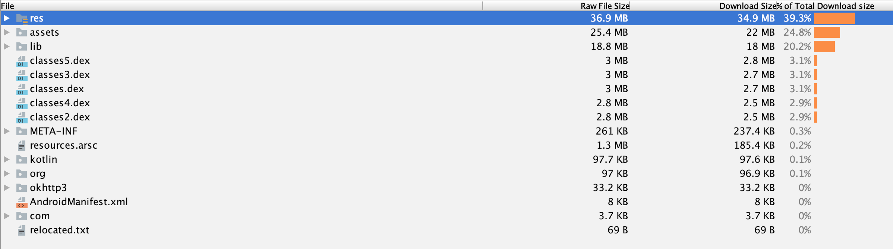

[性能优化之减小-APK-体积](https://leegyplus.github.io/2019/11/06/%E6%80%A7%E8%83%BD%E4%BC%98%E5%8C%96%E4%B9%8B%E5%87%8F%E5%B0%8F-APK-%E4%BD%93%E7%A7%AF/)、[性能优化之减小-APK-体积(实操篇)](https://leegyplus.github.io/2019/11/06/%E6%80%A7%E8%83%BD%E4%BC%98%E5%8C%96%E4%B9%8B%E5%87%8F%E5%B0%8F-APK-%E4%BD%93%E7%A7%AF(%E5%AE%9E%E6%93%8D%E7%AF%87)/) 是探索包体积优化过程中笔记以及对公司项目进行优化的记录，文章比较跳跃，所以在此总结一下，以问题是什么、怎么解决问题的思路组织文字，这样条理更清晰。

## 0x0000 APK 文件结构


一个 APK 解压后的文件结构如上图所示，按照自己的理解可以分为三类：
<!-- more -->
* 代码相关

    classed.dex、classes2.dex

* 资源文件相关

    res/、assets/、resource.arsc

* Native 库

    lib/


* 项目配置

    META-INF/、AndroidManifes.xml

如果想要压缩 Apk 包体积，那么需要从以上三方面入手，以自己目前的认知针对项目配置相关的优化空间不大，那么很明了，要想减少包体积有两个方向：

1. 优化代码
2. 优化资源文件
3. 优化 Native 库

## 0x0001 优化代码，达到包体积优化目的

<br>

### **写出优秀的代码**
<br>

良好的项目架构、代码组织等可以减少大量无用、低效的代码，自然也会在包体积上体现出来。
### **针对第三库的优化**

<br>

很多时候我们引入一个库，但是只使用该库的一小部分功能，那么这时候就可以考虑减少三方库的体积，比如通过源码的形式引入部分功能，如果第三库针对不同功能拆分出来不同体量更小的库，那么只需要根据需求引入相应的库。


### **移除无用的代码**
<br>
显而易见，直观地减小代码量，具体措施：

方式一：

    使用 Lint 检测项目中无用的代码，具体可以使用 AS 直接操作。

方式二：

    使用 Progurad 在编译阶段移除项目中无用的代码。
需要在 build.gradle 中进行配置：

```
buildTypes {
    release {
        minifyEnabled false
    }
}
```

### **代码混淆**

<br>

代码混淆会将相关类和方法混淆成短路径，是由 2 到 1 的转变，可以对项目进行 Proguard 混淆操作， 具体开启方式：

1. 在项目中的 proguard-rules.pro 配置 Proguard 混淆规则

2. 在 build.gradle 中配置 Proguard

``` 
buildTypes {
    release {
        proguardFiles getDefaultProguardFile('proguard-android.txt'), 'proguard-rules.pro'
    }
}
```


### **Dex 优化**
<br>

#### **开启 R8 优化**

<br>

当项目中存在多个 Dex 文件时，存在 Dex 分包导致的包体积增大的问题，具体可以查看 [性能优化之减小-APK-体积](https://leegyplus.github.io/2019/11/06/%E6%80%A7%E8%83%BD%E4%BC%98%E5%8C%96%E4%B9%8B%E5%87%8F%E5%B0%8F-APK-%E4%BD%93%E7%A7%AF/)，所以针对 Dex 的优化空间还是挺大的。

目前谷歌推出了新的压缩工具-R8，来替换原来的 Proguard，R8 兼容 Proguard 混淆、代码压缩等功能，同时也提供了 Dex 优化，得到编译时间更短、编译 Dex 文件更小等效果，以下为在项目中开启 R8 优化的方式。

1. 开启 R8

在 AS 3.1 及以后的版本会默认 R8 作为 Dex 编译器，则不需要再 `gradle.properties` 中显式声明开启 R8 编译工具。
```
// AS 3.0  及以前版本需要手动开启
android.enableD8 = true
```

2. 开启 R8 优化

在 AS 3.4 及更高版本或者 Android Gradle 插件为 3.4 及更高版本中，AS 会默认支持使用 R8 作为混淆工具，否则需要在 `gradle.properties` 中显示声明项目支持 R8 混淆。

```
android.enableR8=true
android.enableR8.libraries=true
```

### **使用 ReDex 去除 debug 信息与行号信息、优化 Dex 分包**

<br>

**什么是 debug 信息与行号信息**

为了方便调试、应用崩溃位置，会调用 debugItem 来获取行号，所以需要在混淆文件中进行相关配置：

```
-keepattributes SourceFile, LineNumberTable
```
这样就会在 Dex 文件中保存 debug 信息与行号信息，根据 Google 统计，debugItem 占 Dex 5% 的体积，所以移除或者减小 debugItem 的大小可以减小包体积。

**Dex 分包导致包体积增大**

由 Dex 分包导致的包体积增大的原因，具体可以查看 [性能优化之减小-APK-体积](https://leegyplus.github.io/2019/11/06/%E6%80%A7%E8%83%BD%E4%BC%98%E5%8C%96%E4%B9%8B%E5%87%8F%E5%B0%8F-APK-%E4%BD%93%E7%A7%AF/) 中的相关内容。

**使用 ReDex 解决 Dex 存在的两个上述问题**

具体如何操作可以参见 [深入探索 Android 包体积优化（匠心制作-上）](https://juejin.im/post/6844904103131234311#heading-34)  一文。


`以上是自己针对减少 Apk 代码的思考`，更多的措施可以查看 [深入探索 Android 包体积优化（匠心制作-上）](https://juejin.im/post/6844904103131234311#heading-34)，该文中有更多跨度比较广的方案，比如说针对二进制文件、使用特定的压缩算法压缩 apk 等，本文关于 Dex 优化方案主要来自于此，之前自己只知道 Dex 分包问题以及可以通过 ReDex 解决，但是没有实操过，直到看到这篇文章。


## 0x0002 优化资源文件


### **使用 Lint 移除无用资源**

Lint 的 Remove Unused Resource 功能。

### **使用 Proguard 的 shrinkResources 配置在编译过程中移除无用资源**

需要在 build.gradle 添加配置：

```
buildTypes {
    release {
        minifyEnabled true
        shrinkResources true
        proguardFiles getDefaultProguardFile('proguard-android.txt'), 'proguard-rules.
    }
}
```

### **图片压缩**

使用  pnggauntlet 等压缩工具替换 aapt 过程中使用的 crunch 压缩算法，已达到更高的压缩率，具体操作可以参见 [性能优化之减小-APK-体积(实操篇)](https://leegyplus.github.io/2019/11/06/%E6%80%A7%E8%83%BD%E4%BC%98%E5%8C%96%E4%B9%8B%E5%87%8F%E5%B0%8F-APK-%E4%BD%93%E7%A7%AF(%E5%AE%9E%E6%93%8D%E7%AF%87)/)。

因为 crunch 会对所有的图片进行预处理，所以针对已经压缩后的图片有可能到图片体积增大，所以需要关闭 crunch 预处理，具体如下操作：

```
buildTypes {
    release {
        ...
        crunchPngs false
    }
}
```

或者

```
aaptOptions {
    cruncherEnabled = false
}
```


### **移除多余的资源**

在 build.gradle 中进行相关配置，只保留特定的资源目录。

```
android {
    ...
    defaultConfig {
	    ...
        resConfigs "zh", "en"
        resConfigs "hdpi", "xhdpi"
    }
}    
```


### **使用混淆**

使用混淆达到减小包体积的原理很简单：缩短资源文件名的长短。

### **使用 AndResGuard 进行资源混淆**

与 Proguard 只能混淆资源文件名不同，AndResGuard 可以 **将资源路径混淆为短路径**，减小 resource.asrc 文件的大小。


## 0x0002 优化 Native 库


### **只保留特定平台的 ABI so 库**

```
defaultConfig {
    ndk {
        abiFilters "armeabi"
    }
}
```

由于 armeabi 可以做到兼容其他平台，所以项目中可以只保留 armeabi 目录。


## 0x0003 总结

以上是自己对包体积优化的理解，只是一些表面的工作以及简单的优化方案，更深层次的优化希望随着对 Android 理解程度不断加深能够有自己的理解。

贴出两个硬核的博文，提出的优化措施覆盖面比较广，可以借鉴研究。

[深入探索 Android 包体积优化（匠心制作-上）](https://juejin.im/post/6844904103131234311#heading-22)、[深入探索 Android 包体积优化（匠心制作-下）](https://juejin.im/post/6872920643797680136#heading-40)

