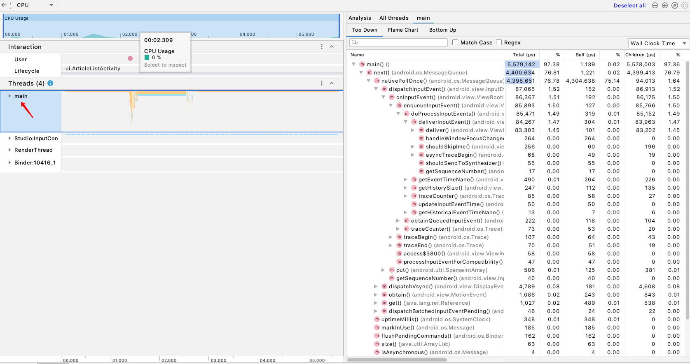

### 0x0001 TraceView 是什么？

一个图形化的工具, 用来 **展示和分析方法的执行时间**.

在发现某个页面或者操作会卡顿时，可以使用 TraceView 定位问题代码，
比如启动，加载图片列表卡顿等情况。

用途：检测卡顿(通过查看方法执行的时间来发现卡顿原因，以此进行解决)。

<!-- more -->

但是现在 TraceView 在高版本的 Android Studio 已经被移除，替换为 Profile，以下的案例分析也是基于 Profile 的。

### 0x0002 通过代码生成 trace 文件

```
public class MainActivity extends Activity {
	@Override
	protected void onCreate(Bundle savedInstanceState) {
		super.onCreate(savedInstanceState);
		setContentView(R.layout.activity_main);
		Debug.startMethodTracing();
	}
 
	@Override
	protected void onDestroy() {
		super.onDestroy();
		Debug.stopMethodTracing();
	}
}
```

项目目录中会生成相应的 `.trace` 文件，使用 adb 将文件拉出来，使用工具打开进行分析。

### 0x0003 使用 Android Studio 生成 trace 文件

使用 AS 中集成的 CPU Profile 记录方法的跟踪数据，具体可以查看官方文档 [使用 CPU Profiler 检查 CPU 活动](https://developer.android.google.cn/studio/profile/cpu-profiler?hl=zh-cn#configurations)、 [使用 CPU Profiler 检查 CPU Activity 和函数跟踪](https://leegyplus.github.io/2019/11/18/%E4%BD%BF%E7%94%A8-CPU-Profiler-%E6%A3%80%E6%9F%A5-CPU-Activity-%E5%92%8C%E5%87%BD%E6%95%B0%E8%B7%9F%E8%B8%AA/) 查看每个图表的具体含义。

### 0x0004 使用 DDMS 生成

目前该工具在 AS 中已移除，可以使用 SDK 中的 Monitor ，但是自测性能极差，不详述，可查看文末链接。

### 0x0005 使用 CPU Profile 定位问题

假如 App 在某个页面产生卡顿，在这里通过 Thread.sleep(1000) 来模拟这种新效果，点击 CPU Profile 相关按钮开始跟踪方法，点击按钮执行 sleep 方法，3s 之后，结束方法跟踪，得到方法跟踪的轨迹图，可以看到 main 线程的方法调用具体如下：



但是通过这样的 Trace 图表来定位问题，无异于大海捞针，产生卡顿的原因为耗时操作阻塞了主线程，基本断定为编码问题，那么这时可以通过匹配 App 的包名来过滤多余信息，过滤结果如下：


可以基本定位在 fetchData 方法中执行了耗时 1s 作用的操作，跳转源码可以看到确实是添加了 sleep 语句，接下来就是解决问题了。

当然这种通过结果去验证过程的做法有些不妥，但是基本上可以使用这种方法更加快速的定位相关问题。

### 0x0006 使用场景

运行 App 过程中，如果发现某个页面发生卡顿或者进行某种操作时，则可以使用 TraceView 定位代码问题。

同时也可以分析启动卡顿、列表加载卡顿等，不过像启动卡顿应该使用代码插桩的形式获得 trace 文件。

### 0x0007 使用 StrictMode(代码逻辑优化) 发现代码中的不规范操作

为了在开发中发现这些容易忽略的问题，我们使用StrictMode，**系统检测出主线程违例的情况并做出相应的反应(弹窗或者崩溃)**，这样就可以通过相关日志定位代码中的不规范写法，最终帮助开发者优化和改善代码逻辑，可以用来检测在 UI 线程中执行的不规范操作，比如进行磁盘读写、网络操作等。

---

**知识链接：**

[使用 Traceview 检查跟踪日志](https://developer.android.google.cn/studio/profile/traceview?hl=zh_cn)

[使用 CPU Profiler 检查 CPU Activity 和函数跟踪](https://leegyplus.github.io/2019/11/18/%E4%BD%BF%E7%94%A8-CPU-Profiler-%E6%A3%80%E6%9F%A5-CPU-Activity-%E5%92%8C%E5%87%BD%E6%95%B0%E8%B7%9F%E8%B8%AA/)


[使用 TraceView 找到卡顿的元凶以及 StrictMode 优化代码逻辑](https://mp.weixin.qq.com/s/zc5yAsCZYYz3-XbvLoRNmg)

TraceView 分析工具可以查看此链接 : [Android 性能分析工具 TraceView](https://zhuanlan.zhihu.com/p/81569027)