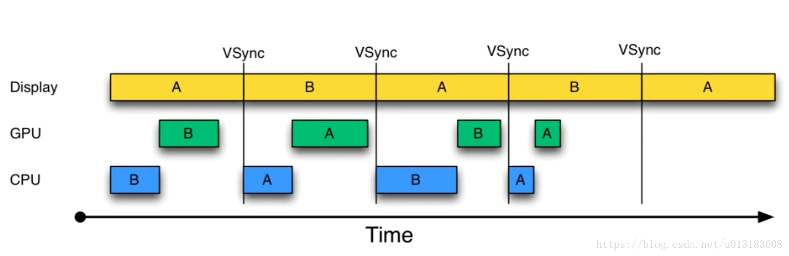

## 0X0000 前言

从 Android 4.1 版本开始，Android 对显示系统进行了重构，引入了三个核心元素：`VSYNC`, `Tripple Buffer`和 `Choreographer`。

<!-- more -->

* VSYNC：Vertical Synchronized的缩写，是一种定时中断；
* Tripple Buffer:在双缓冲技术上，增加显示数据的缓冲区；
* Choreographer：起调度作用，将绘制工作统一到 VSYNC 的某个时间点上，使应用的绘制工作有序进行。

## 0x0001 双缓冲无 Vsync 信号

数据共有两帧，分别为 `Front Buffer`、`Back Buffer`。Display 处理的为 `Front Buffer`，在此同时 CPU 和 GPC处理的为 `Back Buffer`。

<!--  -->

* 在图像数据只有两帧的情况下，如果在 16.6ms 内数据能够完整的处理，那么在下一帧时，屏幕就可以正常显示图像，如上图数据在第一个 16.6ms 没完成数据的处理，在第二个 16.6ms 内显示第一帧图像；

* 如果一个周期内(16.6ms)数据没有被完整的处理，那么在下一个 16.6ms 内就会重复显示上一帧的图像，造成 **丢帧**，如上图第三个 16.6ms 继续显示上一帧的数据；

## 0x0002 双缓冲有 Vsync 信号

从上图可以看到在第二个 16.6ms 开始一段时间后，才开始处理第二帧的数据，效率大打折扣，Android 为此加入了 Vsync 信号。

我个人将 Vsync 理解为类似于时钟信号的中断信号，CPU 在收到 Vsync 信号后，马上开始处理下一帧的数据，这样就避免类上图中情况。

<!--  -->

## 0x0002 三帧技术

在双缓冲技术下，加入 Vsync 信号虽然可以减少卡顿的情况，但是当 CPU/GPU 在一个周期内无法完成数据处理，那么此时就会出现重复显示上一帧数据的情况。
<!-- 
 -->

为了改善上述情况，在原来的两帧技术上，添加了另外一帧的数据 - `Triple Buffer`。`Tripler Buffer` 会在 CPU 或者 GPU 空闲的时候 **提前准备好下一帧的数据**。

一个场景：
* 此时显示 A，GPU、CPU 正在处理 B;
* 在 Vsync 信号来临时，CPU 处理完 B，但是 GPU 没有处理完毕，那么此时 CPU 会处理新的数据 C，并将数据放在 `Triple Buffer` 中;
* 待 GPU 处理完 B 后，屏幕显示 B，GPU 处理已经被 CPU 处理完的数据 C，从而在后续的流程中显示 C。

<!--  -->

从上图可以看到，引入 Triple Buffer 也只能改善卡顿情况，由原来的两个 Jank 变为现在的一个 Jank，并不能彻底解决它。

## 0x0004 浅显启发

所以涉及卡顿，一般会寻找应用中计算量较大的部分，避免在 16.6ms 内 CPU 无法完成相应的计算，从而造成重复显示同一帧的情况。所以可以通过一些手段，定位是哪些进程占用大量的 CPU，比如 top 、adb 等，后续继续探究。

通过以上分析，可以看到影响屏幕绘制的因素有：
1. 绘制任务繁重，需要处理大量的数据，时间大于 16.6ms；
2. 主线程过于繁重，导致在 Vysnc 信号来时没有准备好数据，导致丢帧；

所以应该避免在主线程进行负责的数据计算和网络请求等耗时操作。

---
**知识链接：**
[在 Android 上进行高刷新率渲染](https://mp.weixin.qq.com/s?__biz=MzAwODY4OTk2Mg==&mid=2652054054&idx=1&sn=fe3fbfc0ad36d0a9d6abfd012770c29c&chksm=808c8263b7fb0b751fccc803798951e4ad0cdcaba9162d8d5ae8d13b67a100fd4d2ff5b9a2ae&scene=21#wechat_redirect)
[Android绘制优化：系统显示原理](https://blog.csdn.net/u010215167/article/details/90417761)
[Android 性能优化之 —— 渲染篇](https://shoewann0402.github.io/2016/05/29/Android%E6%80%A7%E8%83%BD%E4%BC%98%E5%8C%96%E4%B9%8B%E2%80%94%E2%80%94%E6%B8%B2%E6%9F%93%E7%AF%87/)
[Android优化——绘制优化之android系统显示原理(一)](https://blog.csdn.net/u013183608/article/details/83061593?utm_medium=distribute.pc_relevant_right.none-task-blog-BlogCommendFromMachineLearnPai2-3.nonecase&depth_1-utm_source=distribute.pc_relevant_right.none-task-blog-BlogCommendFromMachineLearnPai2-3.nonecase)
[来聊聊Activity的显示原理](https://juejin.im/post/5e6640f0e51d4527021907f1)
[WindowManager$BadTokenException-解决方案](https://www.jianshu.com/p/b6e058536087)
[WindowManager$BadTokenException(WindowManager源码分析)](https://www.jianshu.com/p/39f469f1d117)
[5 道刁钻的 Activity 生命周期面试题](https://chuansongme.com/n/3170197953023)